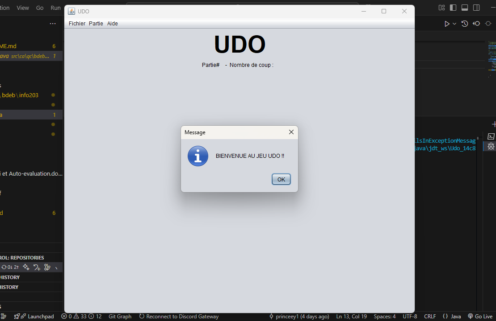
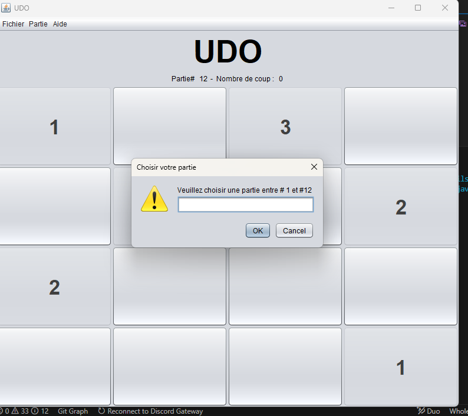
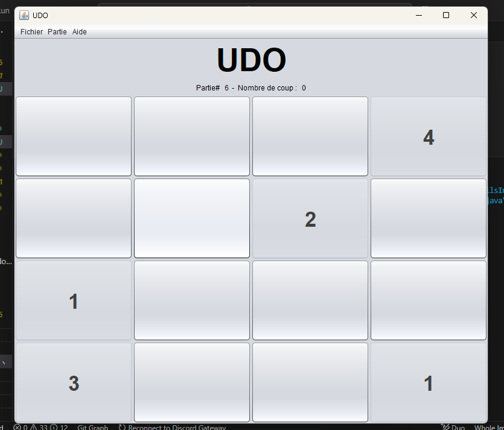
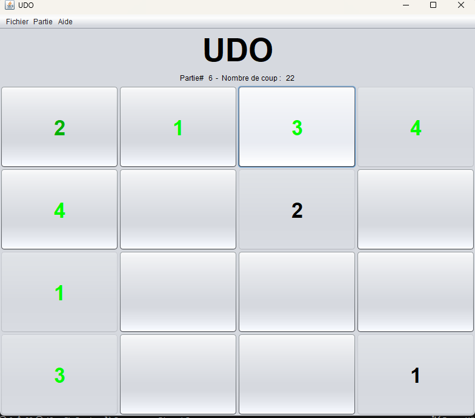
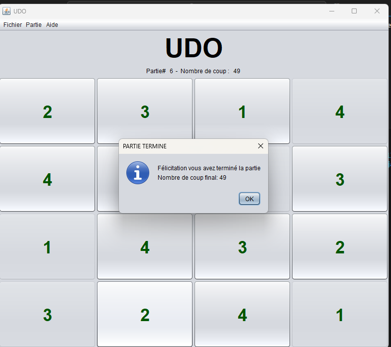

# Udo
## Overview

Udo is a simplified and less stressful alternative to Sudoku. It is a grid-based puzzle game where players must arrange numbers in a 4x4 grid while adhering to specific rules.

## Features

- **Interactive Gameplay**: A graphical user interface built with Java Swing for an engaging experience.
- **Dynamic Grids**: Randomly generated puzzles or user-selected puzzles from a predefined list.
- **Color Feedback**: Visual cues to help players identify correct and incorrect placements.
- **Customizable Appearance**: Uses the Nimbus Look and Feel for a modern UI design.

## Rules

1. Each row must contain the numbers 1-4 without repetition.
2. Each column must contain the numbers 1-4 without repetition.
3. Each 2x2 quadrant must contain the numbers 1-4 without repetition.

## Getting Started

### Prerequisites

- Java Development Kit (JDK) 8 or higher
- A Java IDE (e.g., IntelliJ IDEA, Eclipse, or NetBeans)

### Installation

1. Clone the repository:
    ```bash
    git clone https://github.com/princee1/udo.git
    ```
2. Open the project in your preferred Java IDE.
3. Build the project to resolve dependencies.

### Running the Game

1. Navigate to the [`src/ca/qc/bdeb/info203/main/Main.java`](./src/ca/qc/bdeb/info203/main/Main.java) file.
2. Run the `Main` class to start the game.

## Project Structure

- **`src/ca/qc/bdeb/info203/main`**: Contains the main entry point for the application.
- **`src/ca/qc/bdeb/info203/vue`**: Handles the graphical user interface (GUI) components.
- **`src/ca/qc/bdeb/info203/modele`**: Contains the core game logic and data models.
- **`partie.txt`**: Stores predefined puzzles for the game.

## License

This project is licensed under the MIT License. See the [LICENSE](./LICENSE) file for details.

## Author

Developed by Prince David Madzou - 2019. For inquiries, feel free to reach out via GitHub or email.

## Acknowledgments

- Inspired by the classic Sudoku puzzle game.
- Special thanks to all contributors and testers who helped refine the project.
- Powered by Java Swing for the user interface.

## Screenshots

Here are some screenshots showcasing the gameplay and features of Udo:

1. **Main Menu**  
      
    The main menu where players can start a new game or choose an existing one.

2. **Choose a Puzzle**  
      
    The interface for selecting a specific puzzle to play.

3. **Game Start**  
      
    The initial state of the game grid when a new puzzle begins.

4. **In-Progress Game**  
      
    A snapshot of the game grid during gameplay, showing the interactive features.

5. **Game Completed**  
      
    The screen displayed when a player successfully completes a puzzle.
